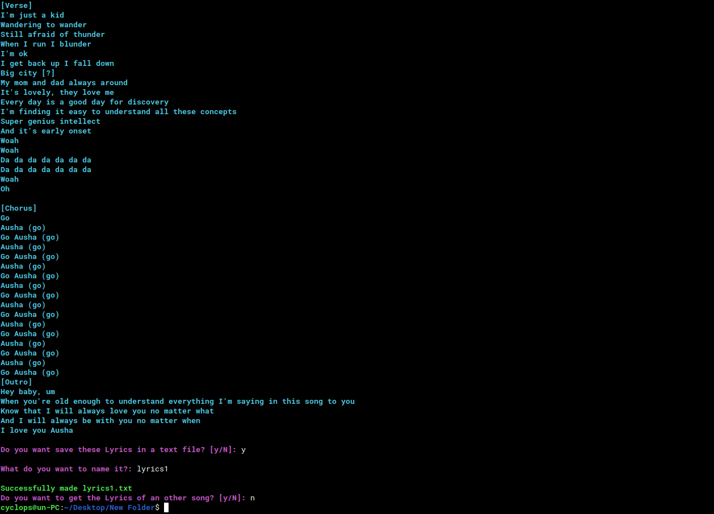

# genius-api
A Python script for searching lyrics artists and songs using genius api, you can also save the lyrics output into nice TXT file
#




# Installation 
Python 3.6+
```
pip install lyricsgenius
```
# Running 
```
python3 genius-api.py
```
